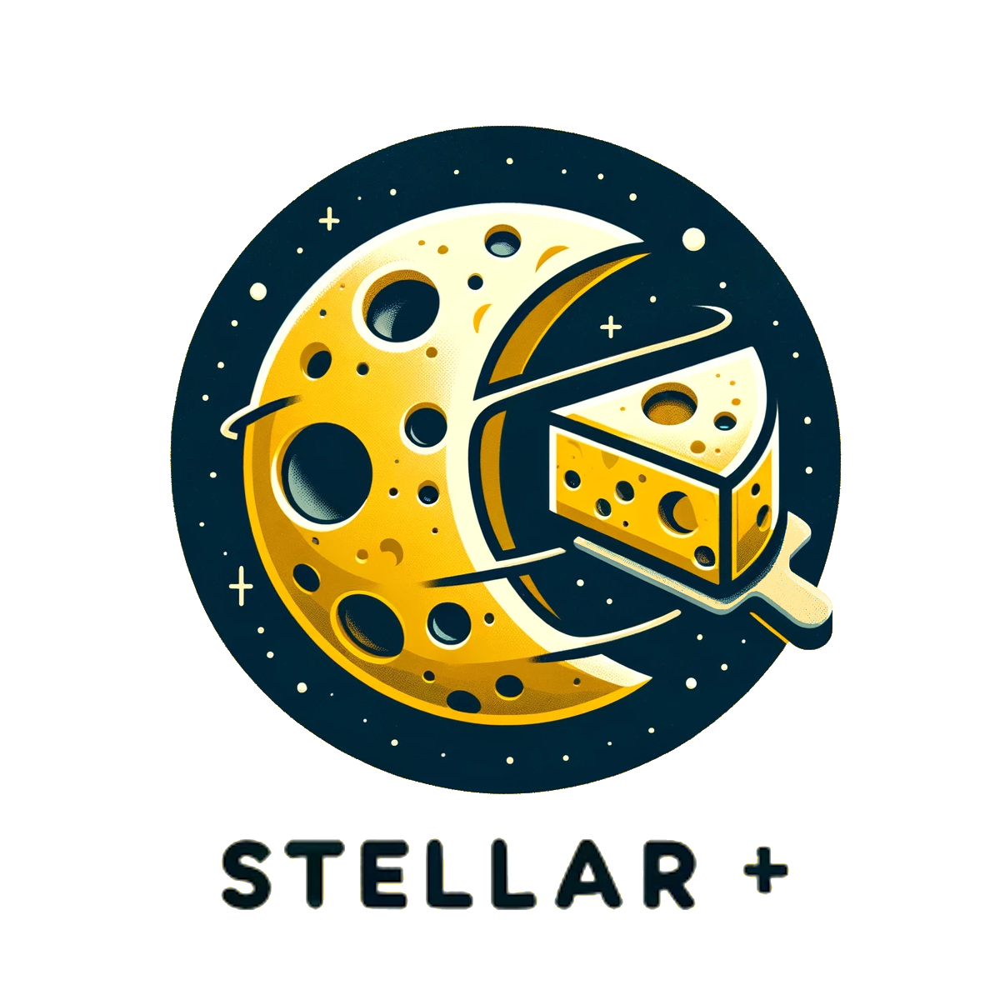

# Stellar-Plus

<p align="center">
  <a href="https://badge.fury.io/js/stellar-plus"></a>
  <a href="https://www.npmjs.com/package/stellar-sdk">
    
  </a>
</p>

<figure>
  <picture>
    <source srcset="docs/.gitbook/assets/logo2.png" media="(prefers-color-scheme: dark)">
    
  </picture>
  <figcaption></figcaption>
</figure>

Stellar-plus is a robust JavaScript library built by [Cheesecake Labs](./) and designed to streamline the development of applications on the Stellar network. By integrating the Stellar community's primary resources, Stellar-plus offers developers an efficient, easy-to-use toolkit. This library simplifies the complexities of Stellar network interaction, making it accessible for both novice and experienced developers alike.

## Features

- **Account Handling**: Seamless management of signatures throughout the transaction lifecycle.
- **Asset Management**: Full suite of asset management capabilities, including standard and custom assets.
- **Core Engines**: Essential for building, submitting, signing, and processing transactions on the Stellar network.
- **Contract Development**: Simplifies the development of decentralized applications (dApps).
- **RPC Integration**: Connects to and leverages various RPC services for a broader range of applications.
- **Plugins and Extensions**: Supports plugins and tools to enhance functionality and tailor the library to specific needs.

## Quick start

Using npm to include js-stellar-plus in your own project:

```shell
npm install --save stellar-plus
```

## Install

Install it using npm:

```shell
npm install --save stellar-plus
```

require/import it in your JavaScript:

```js
var StellarPlus = require('stellar-plus')
```

or

```js
import { StellarPlus } from 'stellar-plus'
```

## Documentation

For the full documentation, refer to our [Gitbook Documentation](https://cheesecake-labs.gitbook.io/stellar-plus/?utm_source=github&utm_medium=codigo-fonte).

- [Code of Conduct](https://github.com/cheesecakelabs/stellar-plus/blob/main/CODE_OF_CONDUCT.md)
- [Contributing Guidelines](https://github.com/cheesecakelabs/stellar-plus/blob/main/CONTRIBUTING.md)
- [MIT License](https://github.com/cheesecakelabs/stellar-plus/blob/main/LICENSE)
