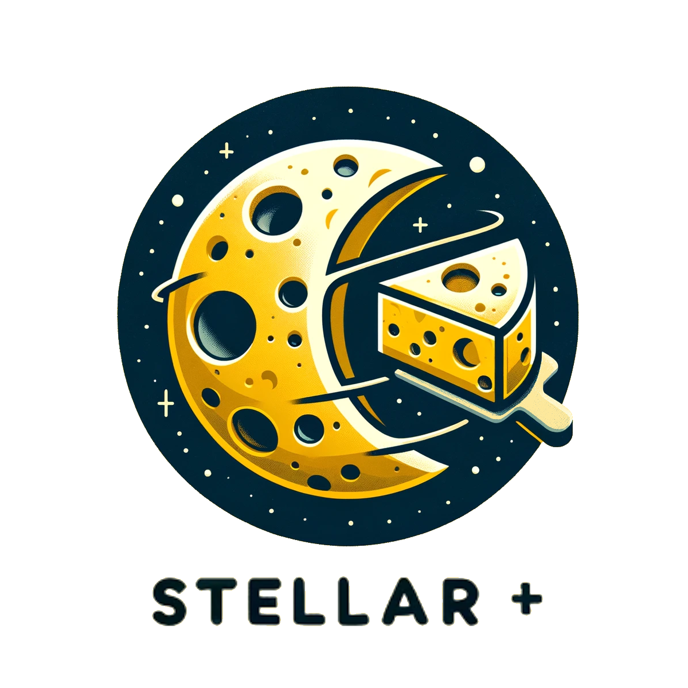

---
layout:
  title:
    visible: true
  description:
    visible: true
  tableOfContents:
    visible: true
  outline:
    visible: true
  pagination:
    visible: true
---

# Welcome

## Stellar-Plus

<figure><picture><source srcset=".gitbook/assets/logo2.png" media="(prefers-color-scheme: dark)"></picture><figcaption></figcaption></figure>

Stellar-plus is a robust JavaScript library built by [Cheesecake Labs](./) and designed to streamline the development of applications on the Stellar network. By integrating the Stellar community's primary resources, Stellar-plus offers developers an efficient, easy-to-use toolkit. This library simplifies the complexities of Stellar network interaction, making it accessible for both novice and experienced developers alike.

## Features

#### Account Handling

Stellar-plus enables seamless account management, facilitating the handling of signatures throughout the transaction lifecycle. It integrates effortlessly with the Freighter Wallet for web applications, ensuring secure and user-friendly account operations.

#### Asset Management

Our library provides a full suite of asset management capabilities. From classic tokens to Soroban tokens adhering to the standard token interface, and bespoke classic assets wrapped in Soroban smart contracts. Stellar-plus leverages standard functionalities with customizable programmability, catering to a wide array of asset management requirements.

#### Core Engines

At the heart of Stellar-plus are its core engines. These are essential for orchestrating the complex processes involved in building, submitting, signing, and processing transactions on the Stellar network.

#### Contract Development

With default contract client implementations, Stellar-plus simplifies the development of decentralized applications (dApps). This feature lowers the barrier to entry for dApp development, fostering innovation and creativity within the Stellar ecosystem.

#### RPC Integration

Stellar-plus includes handlers for connecting to and leveraging various RPC services, such as Validation Cloud's RPC API. This integration enhances the library's flexibility, allowing for a broader range of applications and use cases.

#### Plugins and Extensions

To further enhance its utility, Stellar-plus supports plugins and other tools. These extensions augment the default transaction pipelines, introducing functionalities like fee bump wrapping, automatic state restoration for smart contracts, and management of channel accounts. This modular approach allows developers to tailor the library to their specific needs.

## Commitment to Excellence

Stellar-plus epitomizes our dedication to improving the developer experience on the Stellar network. It offers a streamlined workflow that not only simplifies development tasks but also opens up new avenues for innovative application development.

## Beta Release

Please note that Stellar-plus is currently in beta. This phase is crucial for testing its capabilities and refining its core architecture. We anticipate making significant updates before its first stable release, ready for mainnet deployment. We encourage the community to explore Stellar-plus, provide feedback, and contribute to its evolution.

Thank you for considering Stellar-plus for your Stellar network development needs. We're excited to see the incredible applications you'll build with our library.
